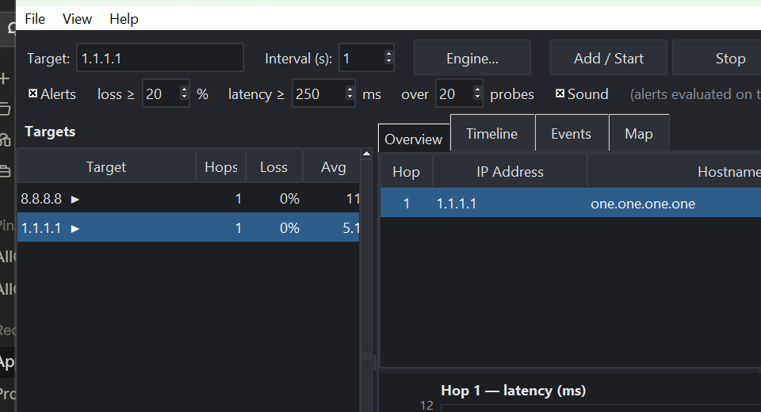

# PingerPlot

[](https://github.com/jamesccupps/PingerPlot/actions/workflows/ci.yml)
[](LICENSE)


A continuous-traceroute network path monitor for Windows (MTR-style): per-hop
latency and packet-loss tracking with a live latency graph, multi-target summary,
MOS scoring, alerts, session save/load, a world map, and ICMP/TCP/UDP probe modes.
Pure Python, **zero third-party dependencies**, dark-themed, HiDPI-aware.



## What it does

Like WinMTR or `mtr`, it discovers every router between you and a target,
then re-probes the whole path on an interval. Each round is effectively a full
traceroute, so you accumulate **min / avg / max / current latency, jitter, and
packet loss for every hop over time** — which makes it obvious *where* along the
path a problem lives (your LAN, your ISP's first hop, a peering point, or the
destination).

- **Route discovery** by walking the IP TTL upward and reading the
  "TTL exceeded" replies (standard traceroute primitive).
- **Continuous monitoring** of all hops, fanned out across a small thread pool
  so each round takes ~one timeout, not the sum.
- **Live hop table** — IP, reverse-DNS hostname, loss %, sent count,
  current/avg/min/max latency, jitter. Rows colour amber/red on loss or high
  latency.
- **Single-hop latency graph** (Overview tab) for the selected hop (click a
  row), with red ticks marking lost probes and a filled area for the trend.
- **All-hops timeline** (Timeline tab) — every hop drawn as a stacked strip on
  a shared time + latency scale, so a latency step shows up as the row where the
  bars get tall. This is the full MTR-style path-over-time view.
- **Continuous auto-retrace + route-change detection** — because every round is
  a full traceroute, reroutes (a hop's address changing) and route length
  grow/shrink are detected live and written to the Events tab.
- **Sustained-degradation alerts** — a red banner + Windows beep + Event-log
  entry when the **destination** shows sustained packet loss or high latency
  over the last *N* probes. Evaluated on the destination only (the one hop whose
  numbers aren't muddied by ICMP-deprioritising routers), and gated so a target
  that simply blocks ICMP never false-alarms.
- **ICMP / TCP / UDP probe modes** — trace with ICMP (default, no admin), or TCP
  SYN to a port / UDP, for paths that block ICMP or to test a specific service.
  See [Probe modes](#probe-modes) for the admin tradeoffs.
- **Multi-target** — monitor many targets at once; a left **summary grid** shows
  each one's hop count, loss, latency, and MOS at a glance. Click one to drive
  the detail tabs. Alerts on any target surface in the banner.
- **MOS (VoIP quality) score** for the destination — one number (ITU-T E-model)
  for "is this path good enough for voice/video", shown live in the status bar.
- **Session save / load** to JSON for offline review, plus **crash-safe
  CSV logging** of every probe (with a per-round index, so "did every hop spike
  in the same round?" is a one-line filter) for unattended overnight runs.
- **Engine options dialog** — packet type & port, reply timeout, payload size,
  send delay (rate throttle), max hops, name resolution, final-hop-only.
- **Dark theme by default**, with a light/dark toggle (button, top-right).
- **HiDPI-aware** — crisp on scaled (150 %/200 %) displays.
- **CSV export** of the per-hop summary (with destination MOS), under a
  self-documenting header that records the interval, timeout, probe mode, packet
  size, sample count, and the exact time window — so two exports can actually be
  compared instead of guessed at.

### Tabs and layout

A left **Targets** summary grid lists every monitored target; selecting one
drives the detail tabs on the right:

| Tab | Shows |
|---|---|
| **Overview** | Hop table (top) over a latency graph for the selected hop (bottom). Click a row to graph it; until you do, it follows the destination. |
| **Timeline** | All hops stacked on a shared time axis — the path-over-time view. Scrolls when there are many hops. |
| **Events** | Timestamped log of route changes, alert raises, and alert clears. |
| **Map** | Geo-located hops plotted on a world map with the path between them. See the privacy note below. |

### Map view & privacy

The Map tab geo-locates each **public** hop via [ipwho.is](https://ipwho.is)
(free, HTTPS, no key) and plots the path on a baked-in Natural Earth coastline
(no runtime dependency). This is the **only** part of the app that contacts a
third party, and it's **opt-in**: nothing is sent until you open the Map tab, and
**private/LAN hops are never looked up** (they have no public location anyway).
Lookups are rate-limited and cached. If you'd rather not send hop IPs anywhere,
just don't open the Map tab.

### Alerts

Set the thresholds in the second toolbar row: **loss ≥ X%**, **latency ≥ Y ms**,
evaluated **over the last N probes** (the window is what makes it "sustained" —
a single spike won't trip a 20-probe window). Set a threshold to `0` to disable
that check. **Sound** toggles the beep. A condition raises when it crosses the
threshold and clears automatically when it recovers; both are logged.

## How it works (and why no admin / no Npcap)

ICMP is sent through the Windows IP Helper API (`IcmpSendEcho` in
`iphlpapi.dll`) via `ctypes`. That API runs in user space, so unlike raw-socket
ping/traceroute tools it needs **no administrator rights and no packet-capture
driver**. The TTL is set per-probe through `IP_OPTION_INFORMATION`, and an
intermediate router that drops the packet answers with status
`IP_TTL_EXPIRED_TRANSIT` plus its own address — that is the whole trick.

IPv4 only, Windows only (by design — it's the Win32 ICMP API). Auto-retrace,
the timeline, alerts, MOS, multi-target, and save/load are all built on this same
user-space primitive, so the whole app runs **without administrator rights** in
ICMP mode.

## Probe modes

ICMP mode is built on the Windows IP Helper API (`IcmpSendEcho`) — the same call
`ping.exe` and `tracert.exe` use internally, which is why it needs no admin. The
other two modes:

| Mode | Needs admin? | Use it for |
|---|---|---|
| **ICMP** | No | Default. Full traceroute + monitoring. |
| **TCP, final-hop-only** | No | "Is this service up, and how fast?" — a TCP handshake to a port (443, 3389, a device's web UI…). No per-hop trace, just the destination. |
| **TCP / UDP, full traceroute** | **Yes** | Per-hop trace when ICMP is blocked/deprioritised. Sends via a normal socket with `IP_TTL`, captures routers' ICMP "TTL exceeded" via a raw `SIO_RCVALL` socket — which requires elevation. |

Without admin, the full TCP/UDP traceroute is refused with a clear message rather
than showing misleading all-timeout hops. (UDP note: an *open* UDP port stays
silent, so it reads as a timeout — prefer TCP for a definitive "service is up".)

## Requirements

- Windows 10/11
- Python 3.10+ (tested on 3.12). Tkinter ships with the python.org installer.
- Nothing to `pip install`.
- ICMP and TCP-final-hop work as a normal user. **Full TCP/UDP traceroute needs
  an elevated (Run as administrator) session.**

## Get it

**Download (no Git needed)** — the easiest way:

1. Grab the latest `Source code (zip)` from the
   [**Releases**](https://github.com/jamesccupps/PingerPlot/releases/latest) page.
2. Right-click the `.zip` → **Extract All…** to anywhere (e.g. your Desktop).
3. Open the extracted folder and **double-click `PingerPlot.vbs`**. That's it —
   no install, no build, no `pip`.

**Or clone with Git:**

```bash
git clone https://github.com/jamesccupps/PingerPlot
cd PingerPlot
```

No build step and nothing to `pip install` — it's pure standard library.
(Optional: `pip install .` registers a `pingerplot` GUI entry point.)

## Run

**Double-click `PingerPlot.vbs`** — launches the GUI with no console window
(uses `pyw`/`pythonw`). That's the everyday launcher.

Other ways:

| | |
|---|---|
| `PingerPlot.vbs` | Double-click launch, no console window (recommended). |
| `Setup.cmd` | Menu: launch / launch-elevated / make shortcuts / enable-or-disable auto-start / status. |
| `python main.py` | From a terminal (console stays open — handy for seeing errors). |
| `run.bat` | Same as above, double-clickable. |

Enter a hostname or IP (e.g. `8.8.8.8`, `1.1.1.1`, `cloudflare.com`, or an
internal address like your gateway), set the interval, and press **Add / Start**.
Add more targets the same way — they stack in the left grid. Click a hop row to
graph it; click a target to switch the detail view. **Engine…** opens the probe
type/port/timeout/logging options; **Save…/Load…** persist a session.

### Shortcuts and auto-start

Run `Setup.cmd` (or `launch.ps1` directly) for one-time setup:

```powershell
.\launch.ps1 -CreateShortcuts    # Desktop + Start-menu icons (normal + an "(Admin)" one)
.\launch.ps1 -InstallAutostart   # auto-start at logon, elevated, with NO UAC prompt
.\launch.ps1 -UninstallAutostart # undo it
.\launch.ps1 -Status
```

`-InstallAutostart` registers a **Task Scheduler** logon task with *Run with
highest privileges*, so the app starts automatically every time you log in —
already elevated (so TCP/UDP traceroute works) and **without a UAC prompt**,
which an on-demand elevated launch can't avoid. It's opt-in: nothing is
registered unless you run that command, and one command removes it.

> **Security note — where you install matters.** Because that task launches
> PingerPlot **elevated with no prompt**, only enable auto-start from a folder
> standard users can't modify — e.g. `C:\Program Files\PingerPlot`. If the
> program folder *or* your Python install sits somewhere you can write *without*
> elevation (your `Downloads`, your home folder, most data drives), then any
> non-elevated process running as you could replace that code and have it run as
> Administrator at your next logon. `-InstallAutostart` checks for this and warns
> you, but doesn't block you. If you don't need persistence, prefer the one-off
> **(Admin)** launch below.

For a one-off elevated launch instead, use the **PingerPlot (Admin)** shortcut,
`Setup.cmd` → option 2, or `.\launch.ps1 -Elevated` (UAC prompts once).

## Reading the results

- **Loss at an intermediate hop while the final hop stays healthy is normal.**
  Many routers rate-limit or ignore the ICMP "TTL exceeded" they're asked to
  generate. Only loss that *carries through to the destination* (the last row)
  indicates a real problem on the path.
- A latency *step* that appears at one hop and persists through every hop after
  it is where the delay is being introduced.
- Sub-millisecond hops show as `<1`; the Win32 RTT is integer-millisecond.

## Tests

```bash
python -m pytest
```

The pure logic (statistics, address encoding, status handling, MOS, alert state
machine, TCP/UDP ICMP correlation) is covered — 56 tests. They are
platform-independent (the Win32 DLL access is guarded behind `sys.platform`), so
the suite runs on Linux/macOS too, and CI runs it on both Linux and Windows. The
raw-socket/Tk layers need real hardware/a display and are exercised by running the
app or `python -m pingerplot.selftest <host>`.

## Project layout

```
main.py            app entry point (python main.py)
PingerPlot.vbs     no-console double-click launcher
launch.ps1         launcher engine: launch / elevate / shortcuts / auto-start / status
Setup.cmd          menu front-end for launch.ps1
run.bat            console launcher (for debugging)
pyproject.toml     packaging metadata + pytest config
pingerplot/
  icmp.py          Windows ICMP via ctypes (IcmpSendEcho), TTL control
  tcpudp.py        TCP/UDP probes via raw SIO_RCVALL capture (admin), parallel per round
  model.py         Hop / Sample / stats / MOS (pure, tested)
  monitor.py       trace + continuous monitor engine, alerts, logging, save/load
  gui.py           Tkinter UI: summary grid, hop table, graphs, events, map
  geoip.py         lazy IP geolocation via ipwho.is (Map tab only)
  worldmap.py      baked Natural Earth coastlines (zero-dependency backdrop)
  selftest.py      headless trace/monitor for the console
tests/             pytest for the pure layers
```

## Possible extensions

- IPv6 (`Icmp6SendEcho2` — different structs, needs a source address).
- Sub-millisecond RTT (would require raw sockets + self-timing).
- Email/webhook alert actions instead of just the banner + beep.
- Per-monitor engine settings (today the toolbar/Engine options apply to the
  next target you Add / Start).

## Contributing

Issues and pull requests are welcome — see [CONTRIBUTING.md](CONTRIBUTING.md).
The hard rules: keep it dependency-free, and keep the Win32 access guarded so the
test suite keeps running on any OS.

## License

[MIT](LICENSE) © James Cupps.

PingerPlot is an independent, hobby open-source project and is not affiliated with
or endorsed by any commercial network-monitoring product. It is a **read-only
diagnostic**: it sends probes and reads replies; it never writes to or
reconfigures anything on the network.
